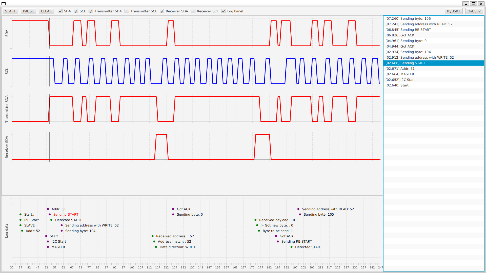

# SimpleLogicAnalyzer

Application to inspect signals together with log information using Arduino and USB-USART converters.



## Usage
Upload the Arduino sketch. Adjust the number of transmitted signals if needed.

Edit the analyzer-properties.json to change names of signals and provide path to the USB device or file containing appropraite data for the analyzer. <br>
Example properties files for both USB and file based operation can be found at `analyzerProperties/`.

Run the application by providing the properties file. Requires JDK 20.
```
mvn -f SimpleLogicAnalyzer/ javafx:run -Djavafx.args="/path/to/the/properties.json"
```

Controls:
- Scroll to move the timeline
- Shift + scroll to zoom in and out
- Use scrollbars to move lists
- Click "START" to send signal to the Arduino to start transmitting measurements. Click "PAUSE" to stop the timeline from moving and "CLEAR" to remove data points and reset the stopwatch. 
- Click the log on the list to highlight it on the Log Panel and show when it was issued.